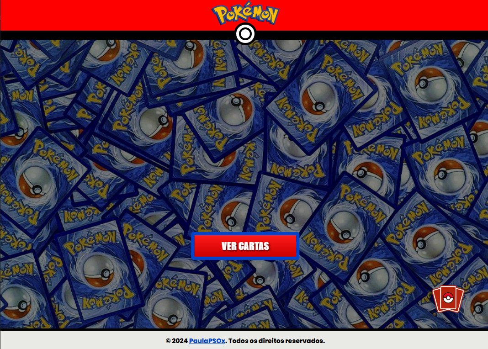
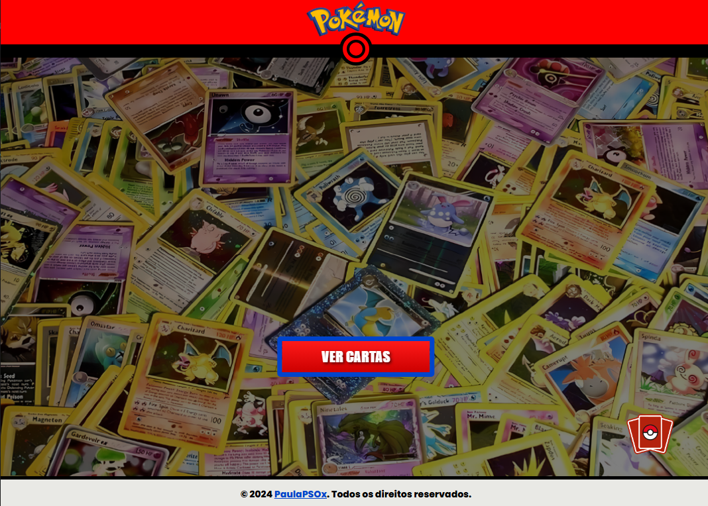
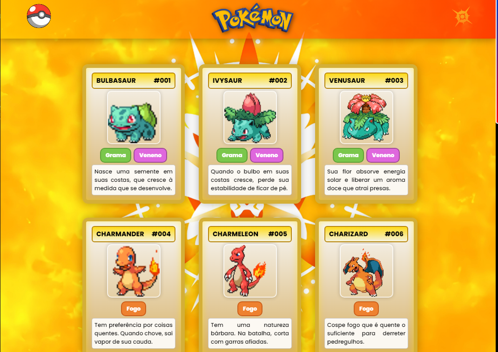
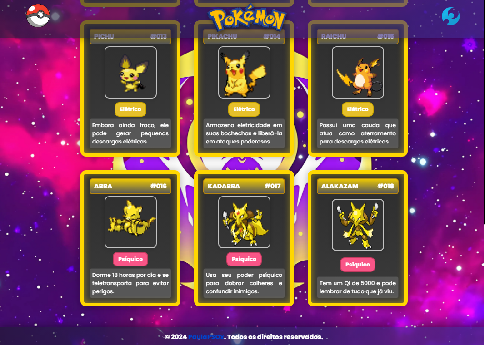
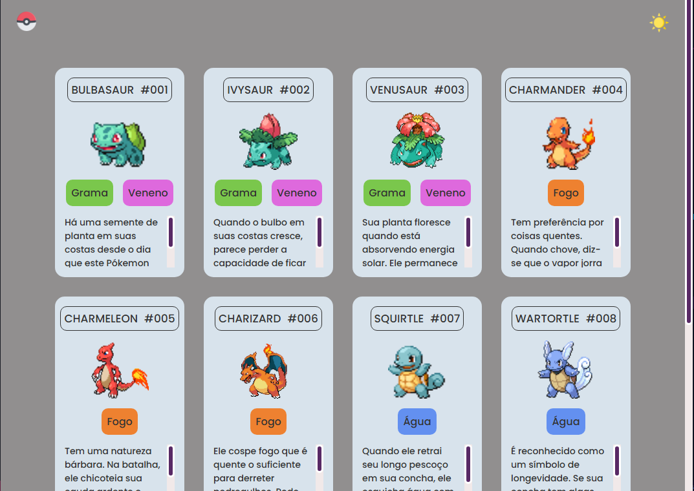
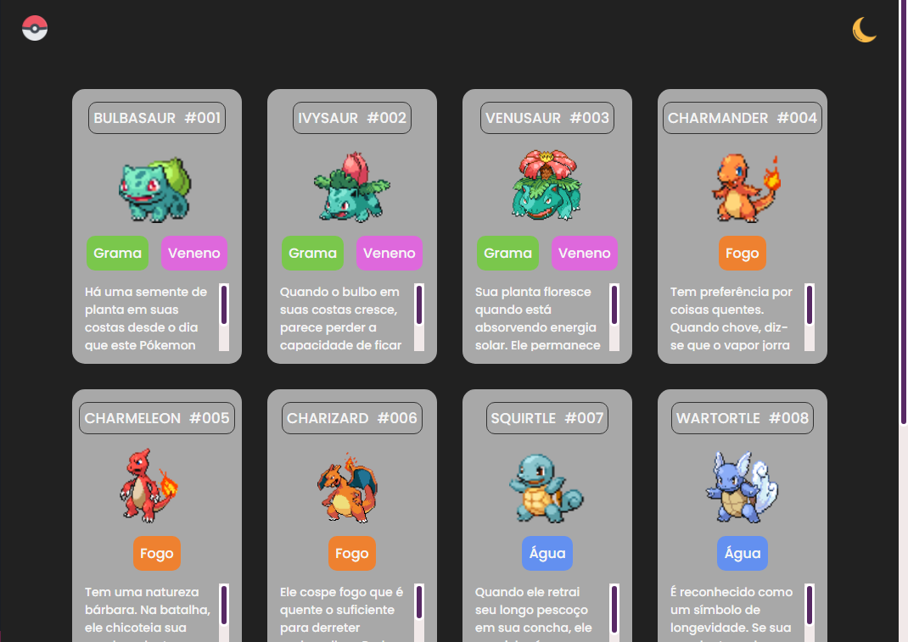

# Pokémon - Lista de Cartas 🐱⚡🔥

Este projeto é uma recriação interativa do universo Pokémon, inspirado nas cartas dos Pokémon, com elementos visuais e referências à série Pokémon. Desenvolvido com **HTML**, **CSS** e **JavaScript**, ele proporciona aos usuários uma experiência de interação dinâmica e divertida com as cartas dos seus Pokémon favoritos. Este projeto é parte do desafio da comunidade **[@Dev Em Dobro](https://github.com/devemdobro)** e da **Guild Dev Em Dobro**, na semana da **Mapa Dev Week**.

---

## Índice

- [Objetivo do Projeto](#objetivo-do-projeto-)
- [Tecnologias Utilizadas 🛠️](#tecnologias-utilizadas-)
- [Estrutura do Projeto 📂](#estrutura-do-projeto-)
- [Descrição dos Arquivos 📄](#descrição-dos-arquivos-)
- [Funcionalidades 🌟](#funcionalidades-)
- [Capturas de Tela 🎨](#capturas-de-tela-)
- [Como Usar 🚀](#como-usar-)
- [Links Úteis 🌐](#links-úteis-)
- [Testes 🔍](#testes-)
- [Contribuição 🤝](#contribuição-)
- [Licença 📜](#licença-)
- [Agradecimentos 🙏](#agradecimentos-)
- [Melhorias Futuras 🚧](#melhorias-futuras-)

---

## Objetivo do Projeto

Recriar a interação com cartas do Pokémon, onde os usuários podem explorar seus Pokémon favoritos em uma experiência visualmente atraente e divertida.

---

## Tecnologias Utilizadas 🛠️

- **HTML**: Estrutura o conteúdo e layout do projeto.
- **CSS**: Responsável pela estilização e apresentação visual das cartas.
- **JavaScript**: Adiciona interatividade para exibir e selecionar as cartas de Pokémon.

---

## Estrutura do Projeto 📂

```
├── src
│   ├── css
│   │   ├── cards.css
│   │   ├── style.css
│   ├── imagens
│   │   ├── logos
│   │   ├── pointer
│   │   ├── pokemons
│   │   ├── theme
│   │   ├── wallpapers
│   └── js
│       ├── cards.js
│       └── script.js
├── cards.html
├── index.html
└── README.md
```

---

## Descrição dos Arquivos 📄

- **cards.css**: Estilos para as cartas de Pokémon, incluindo animações e transições.
- **style.css**: Estilos principais para a página de seleção e layout do site.
- **cards.js**: Lógica JavaScript para interatividade com as cartas de Pokémon.
- **script.js**: JavaScript para a manipulação do comportamento geral da página.
- **images/**: Pasta contendo imagens de Pokémon, logos e outros elementos visuais.

---

## Funcionalidades 🌟

- **Lista de Cartas:** O usuário pode visualizar e interagir com cartas de Pokémon.
- **Interface Responsiva:** A aplicação é otimizada para diferentes dispositivos, proporcionando uma experiência fluida em desktops e dispositivos móveis.
- **Animações e Estilos:** Cartas animadas com CSS e interatividade via JavaScript.
- **Visualização dos Pokémon:** A cada clique, o Pokémon é mostrado com informações relevantes e animações de destaque.

---

## Capturas de Tela 🎨

Abaixo estão algumas capturas de tela do projeto do DevEmDobro e meu projeto seguindo de inspiração, mostrando a lista de cartas do Pokémon:

-> Meu Projeto do Pokemon








-> Projeto do DevEmDobro




---

## Como Usar 🚀

1. Clone este repositório:
   ```bash
   git clone https://github.com/seunome/pokemon-selecao.git
   ```
2. Navegue até a pasta do projeto:
   ```bash
   cd pokemon-selecao
   ```
3. Abra o arquivo `index.html` em um navegador para visualizar o projeto.

---

## Links Úteis 🌐

- Visualizar o projeto: [Pokémon - Lista de Cartas][https://seunome.github.io/pokemon-selecao/index.html](https://paulapsox.github.io/pokemon-lista-de-cartas/)
- Repositório no GitHub: [paulaPSOx/pokemon-lista][https://github.com/seunome/pokemon-selecao](https://github.com/paulaPSOx/pokemon-lista-de-cartas)

---

## Testes 🔍

Para testar o projeto:
1. Certifique-se de que todos os arquivos estão carregados corretamente.
2. Navegue pelas cartas e interaja com elas.
3. Verifique a responsividade e a interatividade em diferentes dispositivos.

---

## Licença 📜

Este projeto é licenciado sob a MIT License - veja o arquivo [LICENSE](https://github.com/seunome/pokemon-selecao/LICENSE) para mais detalhes.

---

## Agradecimentos 🙏

Agradeço à comunidade **[@Dev Em Dobro](https://github.com/devemdobro)** e à **Guild Dev Em Dobro** pelo apoio e recursos durante o desenvolvimento deste projeto na **Mapa Dev Week**!

---

## Melhorias Futuras 🚧

- Adicionar mais Pokémon às cartas.
- Implementar um sistema de pontos ou ranking.
- Melhorar a acessibilidade e o design da interface.

---

Espero que você aproveite a interação com as cartas e explore o mundo Pokémon de uma maneira nova e divertida! ⚡✨🌊🌱
